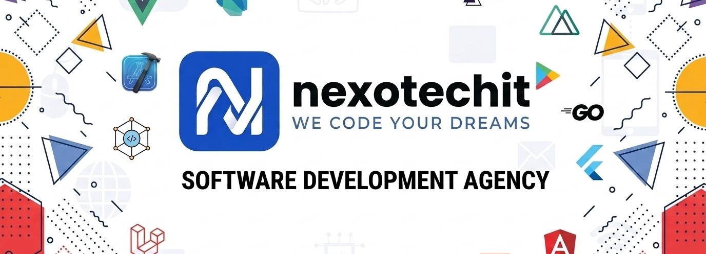

  

<h1 align="center">Welcome to NexoTech IT 🚀</h1>
<h3 align="center">We Code Your Dreams. No jargon, just results.</h3>

  
  
  

---

## ⚡ About Us

At **NexoTech IT**, we believe that premium digital solutions should be accessible and understandable for everyday businesses. We partner with growing businesses, local shop owners, educators, and startups to build custom software that solves actual daily bottlenecks.

Whether it's transitioning an F-commerce store into a fully automated platform or digitizing a school's administration, we build the systems that let you focus on what you do best.

- 🌍 **Based in:** Sylhet, Bangladesh (Serving clients globally)
- 🤝 **Our Promise:** Honest solutions, realistic timelines, and zero tech headaches.
- 💡 **Our Focus:** SaaS, E-Commerce, Learning Management Systems (LMS), and Custom Business Automation.

---

## 🛠️ Our Tech Stack

We specialize in modern, high-performance web development architecture to ensure our clients get secure, scalable, and lightning-fast solutions.

**Frontend:**  

**Backend & Database:** 

---

## 🚀 Our Flagship Solutions

While we build custom software tailored to specific needs, our core scalable platforms include:

- 🛒 **Shopcart:** A powerful E-Commerce and multi-vendor marketplace platform.
- 🎒 **SmartSchool:** A centralized digital solution for school administration and student management.
- 📚 **Eduflow:** An all-in-one Learning Management System (LMS) for course creators.
- 📦 **Softora:** A smart, cloud-based Inventory & POS system for retail shops.
- ✈️ **Natours:** A seamless Travel & Tour booking engine.

---

## 🔒 The NexoTech Guarantees

1. **100% Data Ownership:** Stop relying on social media algorithms. You completely own your platform and your customer data.
2. **24/7 Automation:** Your business never sleeps. We build systems that manage inventory, process sales, and track data around the clock.
3. **Long-Term Support:** We don't just launch your project and disappear. We are your dedicated technical partners.

 

  <i>"Empowering growth through positive digital forces."</i>

